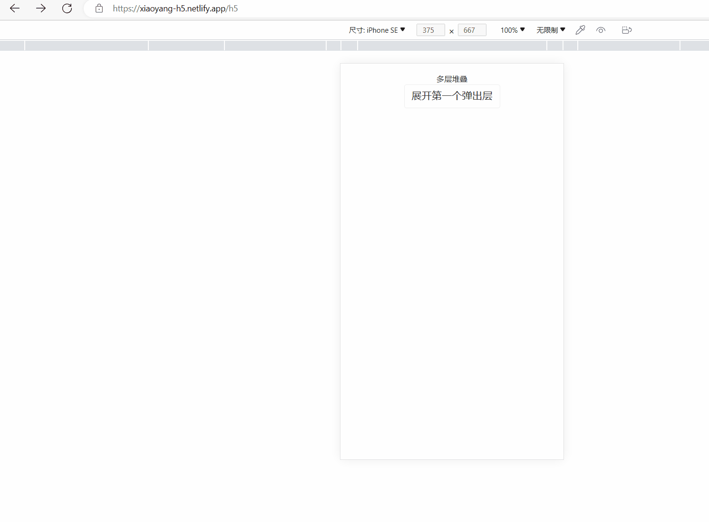

## H5页面物理返回，解决多弹窗返回关闭问题

业务场景：在当前页面，弹出多个弹窗的情况下，不需要返回到上个页面，而是根据返回事件一层一层的关闭弹窗，从而达到比较舒适的交互效果。

## 针对路由场景

主要针对的路由场景：BrowserRouter 或 Hash路由。

## 方案

1. 使用jsSdk的方案拦截物理返回，但是此方法存在一些兼容性问题，特别是在当前大环境下h5页面在多个平台访问已是常态。

2. 使用pushState的方法，增加历史记录，通过监听popState事件，从而拦截返回关闭弹窗。


## 实现效果



### 如何使用

引用封装好的Modal

```jsx
import Popup from '@components/modal';
```

### Modal层代码

```tsx
import useHistoryPopup from '@src/hooks/usePopupHistory';
import { Popup } from 'antd-mobile';
import { ComponentProps } from 'react';

type IPopup = ComponentProps<typeof Popup>;

interface IProps extends IPopup {
  visible?: boolean;
  queryKey?: string;
  queryValue?: number | string | boolean;
  // eslint-disable-next-line no-unused-vars
  setVisible: (visible: boolean) => void;
  [index: string]: any;
}
const Modal = (props: IProps) => {
  const { queryKey, setVisible, visible, onMaskClick, onClose, ...rest } =
    props;
  const { dialogVisible } = useHistoryPopup({ setVisible, queryKey, visible });
  return (
    <Popup
      onClose={() => {
        onClose?.();
        // 弹窗自行关闭时需要执行back，否则会多一个历史记录。
        history.back();
      }}
      visible={dialogVisible}
      onMaskClick={(e) => {
        onMaskClick?.(e);
        // 弹窗自行关闭时需要执行back，否则会多一个历史记录。
        // 可替换为内部业务自己的sdk返回方法
        history.back();
      }}
      {...rest}
    />
  );
};

export default Modal;
```

#### useHistoryPopup.ts

```ts
import { useEffect } from 'react';

interface IProps {
  visible?: boolean;
  queryKey?: string;
  queryValue?: number | string | boolean;
  // eslint-disable-next-line no-unused-vars
  setVisible?: (visible: boolean) => void;
  [index: string]: any;
}

// url 中设置 history.state 的值
function setHistoryState(state: any) {
  history.replaceState(
    {
      ...history.state,
      ...state
    },
    ''
  );
}
// https://github.com/zhaoqize/blog/issues/20
const useHistoryPopup = (props: IProps) => {
  const {
    visible,
    queryKey = 'popup',
    queryValue = 'preview',
    setVisible
  } = props || {};
  const popupKey = queryKey + `=` + queryValue;

  function open() {
    setHistoryState({
      popupKey
    });
    const baseUrl = location.href;
    const url = baseUrl?.includes('?')
      ? baseUrl + `&${popupKey}`
      : baseUrl + `?${popupKey}`;
    // 此时push会多一条历史记录，用绝对地址兼容hashRouter, 可将App.tsx中BrowserRouter替换HashRouter尝试
    history.pushState({ popupKey }, '', url);
    // history.pushState({ popupKey }, '', `?${popupKey}`);
  }

  function back() {
    setVisible?.(false);
  }

  // 判断弹窗是否有返回记录
  function hasBackRecord() {
    return window.history.state?.popupKey === popupKey;
  }

  function onQueryChange() {
    // 监听到返回事件，注意，只有触发了返回才会执行这个方法
    if (hasBackRecord()) {
      back();
    }
  }

  useEffect(() => {
    // 浏览器state变化时，如果存在记录，物理返回会自定清除一次记录
    window.addEventListener('popstate', onQueryChange);
    return () => {
      // 离开页面的时候取消监听popstate
      window.removeEventListener('popstate', onQueryChange);
    };
  }, []);

  useEffect(() => {
    if (visible) {
      // 打开，添加query,增加一条历史记录
      open();
    } else {
      // 否则关闭，此时不会清除历史记录，非popstate触发，需要手动清除历史记录(在弹窗层触发的关闭清除了历史记录)
      if (hasBackRecord()) {
        back();
      }
    }
  }, [visible]);

  return {
    dialogVisible: visible,
    open
  };
};

export default useHistoryPopup;

```

## 项目demo代码地址

https://github.com/532758463/react-mobile

[体验地址](https://xiaoyang-h5.netlify.app/)

## 参考链接

https://juejin.cn/post/7163249902909128711


https://juejin.cn/post/6844903735102013454

https://blog.csdn.net/weixin_34072159/article/details/88031257
